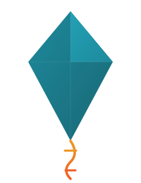

<p align="center">
  
</p>

<h1 align="center">kite</h1>

[](https://github.com/kafkade/kite/actions/workflows/ci.yml)
[](LICENSE-MIT)
[](https://www.rust-lang.org/)

A modern, cross-platform TUI system resource monitor written in Rust — inspired by [btop++](https://github.com/aristocratos/btop).

Kite gives you a real-time, interactive terminal dashboard for CPU, memory, disk, network, GPU, containers, and processes — with full keyboard/mouse control, customizable themes and layouts, configurable alerts, and remote monitoring over SSH.

> **Status**: ✅ v1.0.0 stable — Phase 1 complete. All core metrics, process management, help overlay, and settings menu are live.

---

## Features

### Core Dashboard

- Real-time CPU monitoring (total + per-core, frequency, load averages) with braille graphs
- Memory & swap usage with historical graphs and bar gauges
- Disk I/O rates and filesystem usage
- Network interface traffic with auto-scaling graphs
- 5-panel layout (CPU, memory, disk, network, process table)

### Process Management

- Interactive process table (sort, filter, search, tree view)
- Process signals (SIGTERM, SIGKILL, SIGSTOP, SIGCONT) and renice
- Confirmation dialogs for destructive actions
- Vim-style navigation (`j`/`k`) and keyboard-driven workflow

### UI & Configuration

- Help overlay (`?`) showing all keybindings
- In-app settings menu (`m`) — adjust update interval, graph symbols, toggle panels at runtime
- TOML-based configuration with CLI argument overrides
- Configurable update interval and keybindings
- Input mode system with status bar indicators

### Planned

- **Phase 2**: GPU monitoring, hardware sensors, theming engine
- **Phase 3**: Docker/Kubernetes container monitoring, alerts
- **Phase 4**: SSH remote monitoring, Prometheus export
- **Phase 5**: Accessibility, i18n, platform packaging

---

## Quick Start

### Prerequisites

- [Rust](https://rustup.rs/) 1.85+ (edition 2024)

### Build & Run

```bash
git clone https://github.com/kafkade/kite.git
cd kite
cargo build --release
./target/release/kite
```

### Usage

```
kite [OPTIONS]

Options:
  -i, --interval <MS>  Update interval in milliseconds [default: 1000]
  -h, --help           Print help
  -V, --version        Print version
```

### Keyboard Shortcuts

| Key                | Action                        |
| ------------------ | ----------------------------- |
| `q` / `Ctrl+C`     | Quit                          |
| `?`                | Toggle help overlay           |
| `m`                | Toggle settings menu          |
| `r`                | Force refresh                 |
| `↑`/`↓` or `j`/`k` | Scroll process list           |
| `←`/`→`            | Change sort column            |
| `Space`            | Pause/unpause process updates |
| `/`                | Filter processes              |
| `t`                | Toggle tree view              |
| `K`                | Kill selected process         |
| `PgUp`/`PgDn`      | Page scroll                   |
| `Esc`              | Close overlay / clear filter  |

---

## Configuration

Kite uses a TOML config file located at:

- **Linux/macOS**: `$XDG_CONFIG_HOME/kite/config.toml` or `~/.config/kite/config.toml`
- **Windows**: `%APPDATA%\kite\config.toml`

You can also adjust settings at runtime via the settings menu (`m`).

---

## Architecture

```
src/
├── main.rs              # Entry point, CLI args (clap), async event loop
├── app.rs               # Application state machine, input modes
├── config/              # TOML config loading, keybindings
├── collector/           # Data collection (CPU, memory, disk, network, process)
├── ui/
│   ├── layout.rs        # Layout engine and rendering
│   ├── help.rs          # Help overlay (? key)
│   ├── menu.rs          # In-app settings menu (m key)
│   ├── dialog.rs        # Confirmation dialogs
│   └── widgets/         # Individual panel widgets (cpu_box, mem_box, etc.)
├── input/               # Keyboard event handling with input modes
└── util/                # Ring buffer, unit formatting, error types
```

**Key design patterns:**

- **Collector trait**: Each data source implements `Collector` with async collection, polled by a scheduler at configurable intervals
- **Ring buffer history**: Fixed-size buffers store time-series data for graph rendering
- **Event-driven loop**: `tokio::select!` multiplexes input events, data ticks, and render ticks
- **RAII terminal guard**: Terminal is always restored on exit, even on panic
- **Platform abstraction**: `#[cfg(target_os)]` gates select platform-specific code at compile time

For the full specification, see [`docs/SPEC.md`](docs/SPEC.md).

---

## Contributing

We welcome contributions! Please see our [Contributing Guide](CONTRIBUTING.md) for details on how to get started.

Before contributing, please read our [Code of Conduct](CODE_OF_CONDUCT.md).

For maintainers: see [Releasing](docs/RELEASING.md) for the release process.

---

## Tech Stack

| Component   | Technology          |
| ----------- | ------------------- |
| Language    | Rust (edition 2024) |
| TUI         | ratatui + crossterm |
| Async       | tokio               |
| System data | sysinfo             |
| CLI         | clap (derive)       |
| Config      | serde + toml        |
| Errors      | thiserror + anyhow  |

---

## License

Dual-licensed under [MIT](LICENSE-MIT) or [Apache 2.0](LICENSE-APACHE) at your option.
